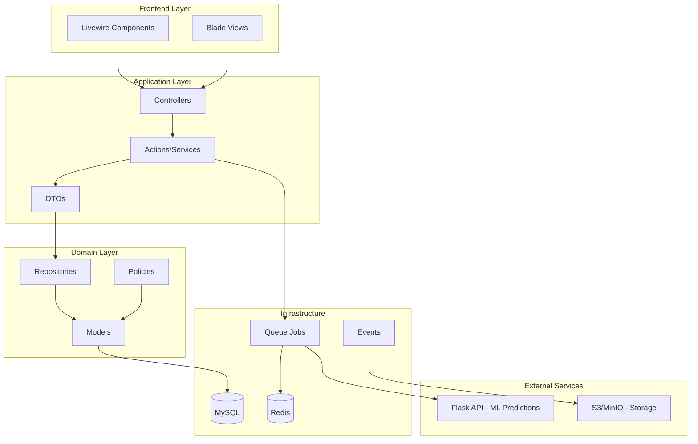

# Nexus WMS - Warehouse Management System


> **Sistema de gestión de inventarios y pedidos multi-sucursal** diseñado para demostrar arquitectura empresarial avanzada, patrones de diseño modernos, y mejores prácticas de desarrollo Laravel.

---

## 📋 Índice

- [Características Principales](#-características-principales)
- [Stack Tecnológico](#-stack-tecnológico)
- [Arquitectura del Sistema](#-arquitectura-del-sistema)
- [Instalación](#-instalación)
- [Uso](#-uso)
- [Testing](#-testing)
- [Roadmap](#-roadmap)

---

## ✨ Características Principales

### 🔐 Control de Acceso Avanzado (RBAC)
- Sistema de **roles y permisos** granulares con Spatie Permission
- **Global Scopes** para filtrado automático por sucursal
- Auditoría completa de acciones con relaciones polimórficas

### 📦 Gestión de Inventario Multi-Sucursal
- Inventario distribuido entre múltiples **almacenes/sucursales**
- Gestión de **productos con variantes** (talla, color, material)
- **Trazabilidad completa** de movimientos de stock
- Transacciones atómicas para prevenir inconsistencias

### 🚀 Importación Masiva Asíncrona
- Carga de archivos Excel/CSV con **miles de productos**
- Procesamiento en **segundo plano con Laravel Queues**
- Notificaciones en **tiempo real** del progreso
- Gestión de colas con **Redis + Horizon** (próximamente)

### 📊 Análisis Inteligente (Microservicio Python/Flask)
- **Integración con API Flask** para análisis predictivo
- Predicción de demanda usando **Machine Learning**
- Alertas automáticas de reabastecimiento
- Arquitectura de **microservicios comunicados por HTTP**

### 📄 Reportes Asíncronos
- Generación de **PDFs en segundo plano**
- Almacenamiento en **S3/MinIO**
- Enlaces de descarga **temporales y seguros**

---

## 🛠 Stack Tecnológico

### Backend
- **Laravel 11** - Framework PHP moderno
- **PHP 8.2** - Tipado estricto y performance mejorado
- **Spatie Permission** - Sistema de roles y permisos
- **Pest PHP** - Testing moderno y elegante

### Frontend
- **Laravel Livewire 3** - Componentes reactivos en PHP
- **Alpine.js** - JavaScript minimalista
- **Blade** - Motor de plantillas de Laravel

### Base de Datos
- **MySQL 8.0** - Base de datos relacional principal
- **Redis 7** - Cache y gestor de colas

### Infraestructura
- **Docker & Docker Compose** - Contenedores para desarrollo
- **Nginx** - Servidor web
- **Laravel Horizon** - Dashboard de colas (próximamente)

### Testing
- **Pest PHP** - Tests unitarios y de integración
- **PHPStan** - Análisis estático de código (próximamente)

---

## 🏗 Arquitectura del Sistema



### Patrón de Arquitectura

**Action Classes Pattern**: Cada operación de negocio crítica es una clase independiente:
```
app/Actions/
├── Inventory/
│   ├── AdjustStockAction.php
│   ├── TransferStockAction.php
│   └── RecalculateStockAction.php
├── Products/
│   ├── CreateProductAction.php
│   └── ImportProductsAction.php
└── Orders/
    ├── CreateOrderAction.php
    └── ProcessOrderAction.php
```

---

## 🚀 Instalación

### Prerrequisitos

- **Docker** y **Docker Compose** instalados
- **Git** instalado

### Paso 1: Clonar el repositorio

```bash
git clone https://github.com/D13G0ARJ/nexus-wms.git
cd nexus-wms
```

### Paso 2: Configurar variables de entorno

```bash
cp .env.example .env
```

> **Nota**: Las credenciales de MySQL y Redis ya están configuradas para Docker. No necesitas cambiar nada para desarrollo local.

### Paso 3: Levantar contenedores Docker

```bash
docker-compose up -d
```

Esto iniciará:
- **App** (Laravel con PHP 8.2-FPM) en el contenedor `nexus_wms_app`
- **Nginx** en [http://localhost:8080](http://localhost:8080)
- **MySQL** en el puerto `3306`
- **Redis** en el puerto `6379`

### Paso 4: Instalar dependencias de Composer

```bash
docker-compose exec app composer install
```

### Paso 5: Generar clave de aplicación

```bash
docker-compose exec app php artisan key:generate
```

### Paso 6: Ejecutar migraciones y seeders

```bash
docker-compose exec app php artisan migrate --seed
```

### Paso 7: Acceder a la aplicación

Abre tu navegador en: **[http://localhost:8080](http://localhost:8080)**

---

## 📚 Uso

### Comandos útiles

#### Ejecutar comandos Artisan
```bash
docker-compose exec app php artisan [comando]
```

#### Acceder al contenedor de la aplicación
```bash
docker-compose exec app bash
```

#### Ver logs de Laravel
```bash
docker-compose exec app tail -f storage/logs/laravel.log
```

#### Detener contenedores
```bash
docker-compose down
```

#### Reconstruir contenedores (después de cambios en Dockerfile)
```bash
docker-compose up -d --build
```

---

## 🧪 Testing

Este proyecto utiliza **Pest PHP** para testing moderno y legible.

### Ejecutar todos los tests
```bash
docker-compose exec app php artisan test
```

### Ejecutar tests con cobertura
```bash
docker-compose exec app php artisan test --coverage
```

### Ejecutar un test específico
```bash
docker-compose exec app php artisan test --filter=CreateOrderTest
```

---

## 🗂 Estructura del Proyecto

```
nexus-wms/
├── app/
│   ├── Actions/          # Lógica de negocio encapsulada
│   ├── DTOs/             # Data Transfer Objects
│   ├── Http/
│   │   ├── Controllers/  # Controladores HTTP
│   │   ├── Requests/     # Form Request Validation
│   │   └── Resources/    # API Resources
│   ├── Models/           # Modelos Eloquent
│   ├── Policies/         # Authorization Policies
│   └── Repositories/     # Repositorios para queries complejas
├── database/
│   ├── migrations/       # Migraciones de base de datos
│   └── seeders/          # Seeders con datos de prueba
├── docker/
│   ├── nginx/            # Configuración Nginx
│   └── php/              # Configuración PHP
├── resources/
│   ├── views/            # Vistas Blade
│   └── js/               # Assets JavaScript
├── tests/
│   ├── Feature/          # Tests de integración
│   └── Unit/             # Tests unitarios
├── docker-compose.yml    # Orquestación de contenedores
├── Dockerfile            # Imagen Docker PHP
└── README.md             # Este archivo
```

---

## 🗺 Roadmap

### ✅ Fase 1: Estructura Inicial (Completado)
- [x] Instalación de Laravel 11
- [x] Configuración Docker
- [x] Instalación de dependencias core
- [x] README y documentación inicial

### 🚧 Fase 2: Base de Datos y Modelos (En Progreso)
- [ ] Migraciones completas
- [ ] Modelos Eloquent con relaciones
- [ ] Seeders con datos realistas
- [ ] Configuración de Spatie Permission

### 📅 Fase 3: Módulos Core
- [ ] Sistema de autenticación
- [ ] CRUD de Productos y Variantes
- [ ] CRUD de Almacenes
- [ ] Sistema de Inventario con transacciones

### 📅 Fase 4: Características Avanzadas
- [ ] Importación masiva con Jobs y Queues
- [ ] API Flask para análisis predictivo
- [ ] Integración Laravel → Flask
- [ ] Reportes PDF asíncronos
- [ ] Websockets para notificaciones en tiempo real

### 📅 Fase 5: Testing y Calidad
- [ ] Cobertura de tests > 80%
- [ ] PHPStan nivel máximo
- [ ] GitHub Actions CI/CD
- [ ] Documentación de API

---

## 👤 Autor

**Armando** - Desarrollador Full Stack

- Portafolio: [En construcción]
- LinkedIn: [linkedin.com/in/d13g0arj](https://www.linkedin.com/in/d13g0arj)
- GitHub: [@D13G0ARJ](https://github.com/D13G0ARJ)

---

## 📄 Licencia

Este proyecto es un **portafolio personal** y está disponible para revisión y aprendizaje. No está bajo ninguna licencia de código abierto en este momento.

---

## 🙏 Agradecimientos

- Estrategia de portafolio basada en mejores prácticas de la industria
- Arquitectura inspirada en principios SOLID y Clean Architecture
- Stack tecnológico seleccionado para demostrar habilidades modernas y demandadas
